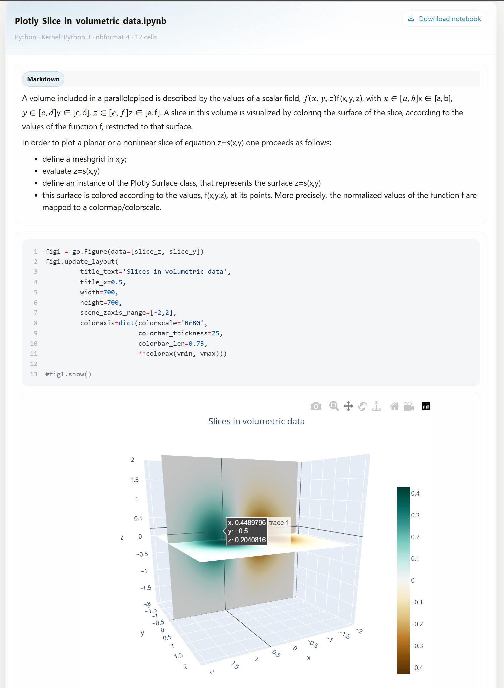

# shortcode-notebook

A **Jupyter Notebook (`.ipynb`) preview shortcode** for Hugo with the **FixIt** theme.

It renders notebook cells (Markdown / Code / Outputs) directly into the page, supports **local** and **remote** notebooks, and provides optional metadata, download link, line numbers, and compact layout.



---

## Requirements

- Hugo **extended** (recommended, because SCSS is typically compiled via `css.Sass` in the inject partial).
- Works best with **FixIt** (uses FixIt helper partial `partial "function/id.html"`), but the core idea can be adapted to other themes if you replace the ID helper.

---

## Install Component

The installation method is the same as installing a theme component. Choose one of the following.

### Install as Hugo Module

First make sure that your project itself is a Hugo module.

Add this component to your `hugo.toml`:

```toml
[module]
  [[module.imports]]
    path = "github.com/hugo-fixit/FixIt"
  [[module.imports]]
    path = "github.com/<YOUR_USER>/<YOUR_REPO>"
````

On the first start of Hugo it will download the required files.

To update to the latest version:

```bash
hugo mod get -u
hugo mod tidy
```

### Install as Git Submodule

Clone FixIt and this repository into your `themes/` directory and add them as submodules:

```bash
git submodule add https://github.com/hugo-fixit/FixIt.git themes/FixIt
git submodule add https://github.com/<YOUR_USER>/<YOUR_REPO>.git themes/shortcode-notebook
```

Then edit `hugo.toml` and add both themes:

```toml
theme = ["FixIt", "shortcode-notebook"]
```

---

## Files Layout

Typical component layout:

```
layouts/
  shortcodes/
    notebook.html
assets/
  css/
    cmpt-notebook.scss
layouts/
  _partials/
    inject/
      cmpt-notebook.html   # optional (styles loader)
```

---

## Use Shortcode

### Minimal (positional argument)

```go-html-template

```

### Named params (local)

```go-html-template

```

### Remote notebook (raw URL)

```go-html-template

```

---

## Parameters

| Parameter                       |   Type |                                                    Default | Description                                                                                                                         |
| ------------------------------- | -----: | ---------------------------------------------------------: | ----------------------------------------------------------------------------------------------------------------------------------- |
| `src` / `file` / positional `0` | string |                                                   required | Notebook path or URL. Positional argument is supported: ``. Named: `src="x.ipynb"` (or `file="x.ipynb"`). |
| `title`                         | string |                                                   filename | Card title in the notebook header. Defaults to the file name extracted from `src`.                                                  |
| `id`                            | string |                                                       auto | Custom ID suffix. Final DOM id becomes `fi-notebook-<id>`. If omitted, generated via FixIt `partial "function/id.html"`.            |
| `language`                      | string |           auto (`metadata.language_info.name`) or `python` | Syntax highlight language for code cells.                                                                                           |
| `show_code`                     |   bool |                                                     `true` | Render code input for code cells.                                                                                                   |
| `show_markdown`                 |   bool |                                                     `true` | Render Markdown and Raw cells.                                                                                                      |
| `show_outputs`                  |   bool |                                                     `true` | Render outputs for code cells.                                                                                                      |
| `show_metadata`                 |   bool |                                                    `false` | Render metadata block (language, kernel, version, nbformat, authors).                                                               |
| `line_numbers`                  |   bool |                                                    `false` | Enable line numbers for highlighted code (`linenos=table`).                                                                         |
| `dense`                         |   bool |                                                    `false` | Compact layout (adds `fi-notebook--dense`).                                                                                         |
| `max_output_height`             | string |                                                    `26rem` | CSS max height for outputs (sets `--fi-notebook-output-max-height`).                                                                |
| `source_url`                    | string |                                                       auto | Overrides the download link URL. By default uses the local resource permalink or the remote `src`.                                  |
| `show_download`                 |   bool |                                                     `true` | Show download button in header when `source_url` is available.                                                                      |
| `download_label`                | string |                                        `Download notebook` | Label next to the download icon.                                                                                                    |
| `empty_message`                 | string | `Notebook is empty or hidden by the current view options.` | Message shown if nothing is rendered due to filters.                                                                                |

---

## Notes on Notebook File Location (Local)

The shortcode tries multiple strategies:

1. Page bundle resources (`.Page.Resources.GetMatch`)
2. Fallback `readFile` search in:

   * `content/`
   * `assets/`
   * `static/`
   * and additionally relative to the current page directory.

Recommended approach: keep notebooks inside the same page bundle (`index.md` + notebook file) or under `static/` if you want them publicly downloadable.

---

## Math (LaTeX outputs)

If your notebook produces `text/latex` outputs, enable MathJax or KaTeX in your theme as needed.

Recommendation:

* Render math as `\[…\]` or `$$…$$` only once.
* If your `text/latex` payload already contains `$...$` / `$$...$$`, strip outer delimiters before re-wrapping to avoid extra `$` in output.

---

## Styling

This component expects a stylesheet (example name: `assets/css/cmpt-notebook.scss`).

### Optional: Load CSS only on pages that use the shortcode (FixIt inject)

If you use FixIt’s inject mechanism, you can conditionally include the CSS only when the page contains ``:

```go-html-template
{{- /* layouts/_partials/inject/cmpt-notebook.html */ -}}
{{- $raw := "" -}}
{{- with .RawContent -}}
  {{- $raw = . -}}
{{- end -}}

{{- /* detect shortcode usage (named or positional) */ -}}
{{- $hasNotebook := or (strings.Contains $raw "{{< notebook") (strings.Contains $raw "{{% notebook") -}}

{{- if $hasNotebook -}}
  {{- $scss := resources.Get "css/cmpt-notebook.scss" -}}
  {{- $cssOpts := dict "targetPath" "css/cmpt-notebook.min.css" "minify" hugo.IsProduction -}}
  {{- if not hugo.IsProduction -}}
    {{- $cssOpts = dict "sourceMap" "inline" | merge $cssOpts -}}
  {{- end -}}
  {{- $css := $scss | css.Sass $cssOpts | fingerprint -}}
  <link rel="stylesheet" href="{{ $css.RelPermalink }}" integrity="{{ $css.Data.Integrity }}">
{{- end -}}
```

This keeps the global payload smaller: pages without notebooks won’t load notebook CSS.

---

## Troubleshooting

### “Notebook could not be located…”

* Ensure the `.ipynb` file exists where you reference it.
* If it’s in a page bundle, verify it is included in the bundle and not excluded by `ignoreFiles`.

### Remote notebooks fail to fetch

* Use raw URLs (`raw.githubusercontent.com/...`) not GitHub HTML pages.
* Check network access during build.
